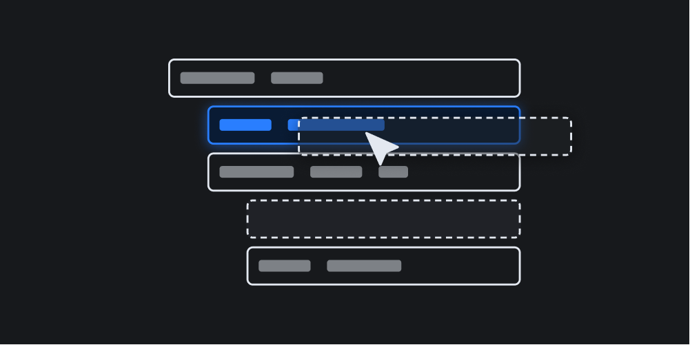

# Sortable Tree

[](https://www.npmjs.com/package/sortable-tree)
[](https://github.com/marcantondahmen/sortable-tree/blob/master/LICENSE)


Easily create _sortable_, _draggable_ and _collapsible_ trees &mdash; vanilla TypeScript, lightweight and no dependencies.

[](https://marcantondahmen.github.io/sortable-tree/)

:wave: [Check out the demo](https://marcantondahmen.github.io/sortable-tree/)

---

- [Getting Started](#getting-started)
  - [NPM](#npm)
  - [CDN and Browser](#cdn-and-browser)
- [Options](#options)
  - [The `nodes` Object in Detail](#the-nodes-object-in-detail)
  - [Rendering Nodes](#rendering-nodes)
  - [Customizing Styles and Icons](#customizing-styles-and-icons)
  - [The `onChange` Function](#the-onchange-function)
  - [The `onClick` Function](#the-onclick-function)
  - [Confirming Changes](#confirming-changes)
- [The Tree Object](#the-tree-object)
  - [Tree Methods](#tree-methods)
    - [`findNode(key: string, value: unknown)`](#findnodekey-string-value-unknown)
    - [`getNode(id: string)`](#getnodeid-string)
- [Nodes](#nodes)
  - [Node Propterties](#node-propterties)
  - [Node Methods](#node-methods)
    - [`collapse(state: boolean)`](#collapsestate-boolean)
    - [`reveal()`](#reveal)
    - [`toggle()`](#toggle)
- [Styling](#styling)
  - [Custom Properties](#custom-properties)
  - [Demo Theme](#demo-theme)

## Getting Started

You can either install this [package](https://www.npmjs.com/package/sortable-tree) with `npm` and import it into your JavaScript or TypeScript project or use it in a browser.

### NPM

Install with `npm`:

```
npm i sortable-tree
```

Import into your project and create a tree as follows:

```typescript
import SortableTree, { SortableTreeNodeData } from 'sortable-tree';
import 'sortable-tree/dist/sortable-tree.css'; // basic styles

const nodes: SortableTreeNodeData[] = [
  {
    data: { title: 'Home' },
    nodes: [
      { data: { title: 'Page 1' }, nodes: [] },
      {
        data: { title: 'Page 2' },
        nodes: [{ data: { title: 'Subpage' }, nodes: [] }],
      },
    ],
  },
];

const tree = new SortableTree({
  nodes: nodes,
  element: document.querySelector('#tree'),
  renderLabel: (data) => {
    return `<span>${data.title}</span>`;
  },
  onChange: ({ nodes, movedNode, srcParentNode, targetParentNode }) => {
    console.log(movedNode.data);
  },
  onClick: (event, node) => {
    console.log(node.data);
  },
});
```

### CDN and Browser

In order to use this package in a browser just load add the following tags to your `<head>` section:

```html
<script src="https://unpkg.com/sortable-tree/dist/sortable-tree.js"></script>
<link
  href="https://unpkg.com/sortable-tree/dist/sortable-tree.css"
  rel="stylesheet"
/>
```

Add use it in your body as follows:

```html
<div id="tree" class="tree"></div>
<script>
  const nodes = [
    {
      data: { title: 'Home' },
      nodes: [
        { data: { title: 'Page 1' }, nodes: [] },
        {
          data: { title: 'Page 2' },
          nodes: [{ data: { title: 'Subpage' }, nodes: [] }],
        },
      ],
    },
  ];

  const tree = new SortableTree({
    nodes: nodes,
    element: document.querySelector('#tree'),
    renderLabel: (data) => {
      return `<span>${data.title}</span>`;
    },
    onChange: ({ nodes, movedNode, srcParentNode, targetParentNode }) => {
      console.log(movedNode.data);
    },
    onClick: (event, node) => {
      console.log(node.data);
    },
  });
</script>
```

In both scenarios, a sortable tree is rendered based on an array of `node` objects. Every node must consist of a `data` and a `nodes` property. While the `data` object is nothing more than a collection of key/value pairs that are passed to the `renderLabel()` function, the `nodes` property represents the array of subnodes that have the same recursive structure.

## Options

The following options can be used when creating a new tree object:

```typescript
const tree = new SortableTree({
  nodes: nodes,
  element: document.querySelector('#tree'),
  icons: {
    collapsed: '+',
    open: '-',
  },
  styles: {
    tree: 'tree',
    node: 'tree__node',
    nodeHover: 'tree__node--hover',
    nodeDragging: 'tree__node--dragging',
    nodeDropBefore: 'tree__node--drop-before',
    nodeDropInside: 'tree__node--drop-inside',
    nodeDropAfter: 'tree__node--drop-after',
    label: 'tree__label',
    subnodes: 'tree__subnodes',
    collapse: 'tree__collapse',
  },
  stateId: 'some-tree',
  lockRootLevel: true,
  disableSorting: false,
  initCollapseLevel: 2,
  renderLabel: async (data) => {
    return `<span>${data.title}</span>`;
  },
  confirm: async (moved, parentNode) => {
    return true;
  },
  onChange: async ({ nodes, movedNode, srcParentNode, targetParentNode }) => {
    console.log(movedNode.data);
  },
  onClick: async (event, node) => {
    console.log(node.data);
  },
});
```

| Name                | Description                                                                                                                                             |
| ------------------- | ------------------------------------------------------------------------------------------------------------------------------------------------------- |
| `nodes`             | An array of [node objects](#the-nodes-object-in-detail) (required)                                                                                      |
| `element`           | The container element where the tree will be created in (required)                                                                                      |
| `icons`             | An object of [custom icons](#customizing-styles-and-icons) in the shape of `{ collapsed: '+', open: '-' }` to indicate that a node is open or collapsed |
| `styles`            | An optional object of [CSS classes](#customizing-styles-and-icons) that are used for the tree elements                                                  |
| `lockRootLevel`     | Prevent moving nodes to the root level (default: `true`)                                                                                                |
| `disableSorting`    | Disable sorting functionality                                                                                                                           |
| `initCollapseLevel` | The level of nesting that will be initially collapsed (default: `2`)                                                                                    |
| `stateId`           | The id that is used to persist the folding state of the tree across browser reloads (optional)                                                          |
| `renderLabel`       | A function that will be used to [render a node's label](#rendering-nodes)                                                                               |
| `onChange`          | An async [function](#the-onchange-function) that is called when the tree has changed                                                                    |
| `onClick`           | An async [function](#the-onclick-function) that is called when a node label has been clicked                                                            |
| `confirm`           | An async function that is used to [confirm](#confirming-changes) any changes in the tree                                                                |

### The `nodes` Object in Detail

The `nodes` object contains the initial array of nodes that is used to construct the tree. A node is a recursive object that contains itself other (sub)nodes and must contain the following two items:

- `data`: An `SortableTreeKeyValue` object that is passed to the `renderLabel` function
- `nodes`: An array of subnodes that have the same shape as the node itself

### Rendering Nodes

The `renderLabel` function controls the HTML of the actual node label that is clickable and draggable. As mentioned before, the `data` object of the rendered noded is passed as argument. Asumming the following `nodes` object:

```typescript
const nodes = [
  data: {
    title: 'Homepage',
    path: '/'
  },
  nodes: []
]
```

A typical implementation that uses the `title` and `path` fields could look like:

```typescript
const tree = SortableTree({
  nodes,
  element: document.querySelector('#tree'),
  renderLabel: (data) => {
    return `
      <span data-path="${data.path}">
        ${data.title}
      </span>`;
  },
});
```

### Customizing Styles and Icons

It is possible to override the class names that are used when rendering the tree. The following fields can be defined in the object that used with the `styles` option:

```typescript
const tree = new SortableTree({
  nodes: nodes,
  element: document.querySelector('#tree'),
  icons: {
    collapsed: '<span class="my-icon">+</span>',
    open: '<span class="my-icon">-</span>',
  },
  styles: {
    tree: 'my-tree',
    node: 'my-tree__node',
    nodeHover: 'my-tree__node--hover',
    nodeDragging: 'my-tree__node--dragging',
    nodeDropBefore: 'my-tree__node--drop-before',
    nodeDropInside: 'my-tree__node--drop-inside',
    nodeDropAfter: 'my-tree__node--drop-after',
    label: 'my-tree__label',
    subnodes: 'my-tree__subnodes',
    collapse: 'my-tree__collapse',
  },
});
```

### The `onChange` Function

The `onChange` function is called whenever a node is dropped successfully somewhere in the tree and a `SortableTreeDropResultData` object is passed as argument.
A `SortableTreeDropResultData` object consists of three items:

- `nodes`: The tree structure that contains a `id`, `element` and `subnodes` for each node
- `movedNode`: The [node](#nodes) that has been moved
- `srcParentNode`: The original parent [node](#nodes)
- `targetParentNode`: The new parent [node](#nodes)

```typescript
const tree = SortableTree({
  nodes,
  element: document.querySelector('#tree'),
  onChange: async ({ nodes, movedNode, srcParentNode, targetParentNode }) => {
    const data = movedNode.data;
    const src = srcParentNode.data;
    const target = targetParentNode.data;

    console.log(data, src, target);
    console.log(nodes);
  },
});
```

### The `onClick` Function

The `onClick` function is called whenever a node label is clicked.
The original event object as well as the clicked [node](#nodes) are passed as arguments.

```typescript
const tree = SortableTree({
  nodes,
  element: document.querySelector('#tree'),
  onClick: async (event, node) => {
    console.log(event, node);
  },
});
```

### Confirming Changes

Whenever a node is dropped, it is possible to request confirmation before actually moving a node. Therefore an `async` function can be assigned to the `confirm` as follows:

```typescript
const tree = SortableTree({
  nodes,
  element: document.querySelector('#tree'),
  confirm: async (movedNode, targetParentNode) => {
    return confirm('Are you sure?');
  },
});
```

## The Tree Object

The tree object represents the collection of nodes and allows for retrieving nodes by id or values from the initial dataset.

### Tree Methods

The following public methods are available:

#### `findNode(key: string, value: unknown)`

You can search for a [node](#nodes) by a key/value pair in the initial nodes [data object](#node-propterties) that was used to create the tree by using the `findNode` method. Note that only the first match is returned:

```typescript
const tree = new SortableTree(options);
const node = tree.findNode('title', 'home');

console.log(node.id);
console.log(node.data);
```

#### `getNode(id: string)`

In case you have already a id of a node from a previous search or similar, you can use the `getNode` method to get the node from the tree:

```typescript
const node = tree.getNode(id);
```

## Nodes

Nodes represent the based units a tree consists of. Nodes can also contain other nodes.

### Node Propterties

The following public properties can be accessed on a node element:

| Name           | Description                                                           |
| -------------- | --------------------------------------------------------------------- |
| `data`         | The custom data object that was assigned when creating the tree       |
| `label`        | The clickable and draggable label element                             |
| `subnodes`     | The container element that hosts the subnodes                         |
| `subnodesData` | An array of datasets that are stored in the direct children           |
| `id`           | The node's id that can be used to get the node from the tree instance |

### Node Methods

Every node exposes the folowing public methods:

#### `collapse(state: boolean)`

You can control the `collapse` state of a node as follows:

```typescript
const tree = new SortableTree(options);
const node = tree.findNode('title', 'home');

node.collapse(true); // Hide all subnodes
node.collapse(false); // Show all subnodes
```

#### `reveal()`

The `reveal` method can be used to unfold the tree down to the node:

```typescript
const tree = new SortableTree(options);
const node = tree.findNode('title', 'home');

node.reveal();
```

#### `toggle()`

The `toggle` method is used to toggle the `collapse` state.

## Styling

The [included styles](#custom-properties) only cover the most basic functionality such as collapsing and indentation.
All other styling and theming is dependend on the project the tree is used in.
As mentioned above, also the markup of the rendered nodes is flexible and can be controlled with the `renderLabel` function.
[Check out the demo](https://marcantondahmen.github.io/sortable-tree/) for some examples for theming and styling.

### Custom Properties

The following [CSS custom properties](src/styles.less) are available to control the basic appearance of a tree:

| Name                         | Description                                                             |
| ---------------------------- | ----------------------------------------------------------------------- |
| `--st-label-height`          | The height of the node's label                                          |
| `--st-subnodes-padding-left` | The indentation of subnodes                                             |
| `--st-collapse-icon-height`  | The height of the icon container that can be clicked to toggle subnodes |
| `--st-collapse-icon-width`   | The width of the icon container                                         |
| `--st-collapse-icon-size`    | The actual `font-size` of the collapsing icon                           |

### Demo Theme

In order to get started quickly, you can take a look at the styles of the [demo theme](demo/tree.less) that cover most of the needed custom styling.

---

&copy; 2023 Marc Anton Dahmen, MIT license
